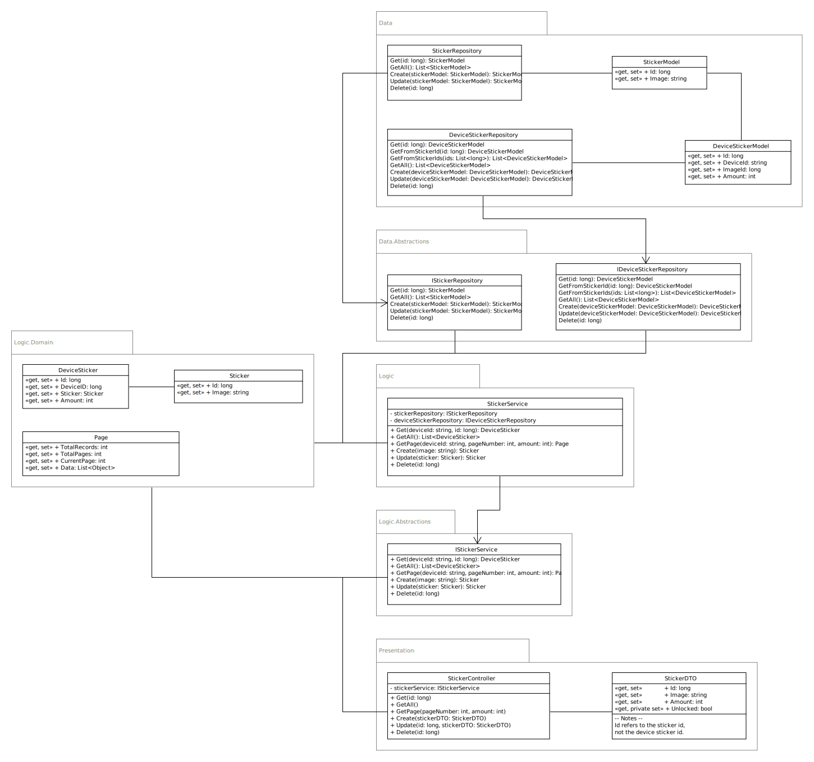

# kind-regards-api
Backend API for the prototype of "Kind Regards"

## Table of contents

<!-- TOC -->

- [kind-regards-api](#kind-regards-api)
    - [Table of contents](#table-of-contents)
    - [Documentation](#documentation)
    - [Before you start](#before-you-start)
        - [Application structure](#application-structure)
        - [Environment files](#environment-files)
        - [Architecture overview](#architecture-overview)
        - [Main layers](#main-layers)
        - [Abstraction layers](#abstraction-layers)
        - [IoC layers](#ioc-layers)
        - [Controller discovery](#controller-discovery)
        - [Choices](#choices)
        - [Class diagram](#class-diagram)
    - [Running the project](#running-the-project)
        - [MySQL database](#mysql-database)
        - [Entity framework](#entity-framework)
            - [Clean database](#clean-database)
            - [Run migrations](#run-migrations)
            - [Create migrations](#create-migrations)
        - [Visual studio](#visual-studio)
        - [Visual studio code](#visual-studio-code)
        - [Dotnet CLI](#dotnet-cli)
        - [Docker](#docker)
    - [Future improvements](#future-improvements)
    - [Todo](#todo)
        - [Testing](#testing)
        - [Websocket integration (WIP)](#websocket-integration-wip)

<!-- /TOC -->

## Documentation
This project includes documentation that explain the structure and architecture of this API. These files can be found within the `docs` folder. Our diagrams are being made in several applications, the source files for these diagrams can be found in the folders that have the name of the application it has been made with. The following programs have been used to create the diagrams:

- Draw.io
- Umlet

## Before you start
This section is an introduction to this project and contains valuable information that hopefully speeds up the development process for future groups.

### Application structure
This project has been built with a layered architecture in mind. The layers are being used to separate the responsibilities of each class in a more structured way.

The default project (and application starting point) is `KindRegardsApi.Host`. This project houses the asp.net application which handles the setup of the asp.net application, it should only be used for that.

**Note:** Make sure you are running the `KindRegardsApi.Host` application, and not a any of the other project applications. Each application other than `KindRegardsApi.Host` is a class library project and will not have a starting point.

### Environment files
This application has two environment files that are being used: `appsettings.json` and `appsettings.Docker.Dev.json`. `appsettings.json` is being used for production, and `appsettings.Docker.Dev.json` is being used for the Docker dev flow. These files currently exist within version control,

### Architecture overview


### Main layers
A main layer is a layer that has a (partial) implementation of a functionality. The main layers for this project are: `Presentation`, `Logic`, `Domain`, `Entity`, and `Data`.

**Presentation**<br/>
The presentation layer is responsible for taking in all requests and generating a JSON response for it. It uses DTOs to prevent requests from changing more data than it should.

**Logic**<br/>
The logic layer is responsible for the business logic. Everything that needs to be calculated or transformed should exist in here.

**Domain**<br/>
The domain layer contains all business objects.

**Entity**<br/>
The entity layer contains all database entities. Each file name uses the `Entity` prefix in its class and file name to differentiate from business objects.

**Data**<br/>
The data layer is responsible for retrieving and storing data inside a database. This application uses a MySQL (MariaDB) database to store all of its information.

### Abstraction layers
An abstraction layer contains the interfaces that a layer may use. The layout of these layers are the same as their main layer counterpart, but instead of implementations they only include abstractions (interfaces).

### IoC layers
An IoC (Inversion of Control) layer has a direct dependency on a almost all layers within the architecture. These dependencies are used to provide ASP.net the correct information to make the dependency injection process work.

Each IoC layer only contains a `[LAYERNAME]ServiceCollectionExtensions.cs` class. This is being used by ASP.net to configure the dependency injection tree.

### Controller discovery
The `Host` layer will auto-discover controllers inside the `Presentation` layer. You only have to create a new file, mark it with the `[ApiController]` annotation, give it a route and you're done.

### Choices
- The usage of a `Host` project brings the advantage that each main layer that is being used (`Presentation`, `Logic`, `Domain`, `Entity`, and `Data`) only has to think about their own implementations. The `Host` will make sure that all IoC layers are being included in the dependency injection process.
- Each service has an interface to make unit-testing easier, and to respect the asp.net dependency injection pattern.
- Abstraction layers are used to keep layers from leaking into each other. A main layer should never need to know about the implementations of other main layers, only their abstractions.
- A relational database system was chosen because our data entities have close ties with each other.
- The API auto-migrates it's database on every request. This is done to ensure that it can run inside a docker container. At the time of writing this there wasn't any way to migrate the database during the application startup. (Please look into this again)
- Websockets were chosen to provide real-time communication between the API and the Unity project. It was the only real choice we had since polling will strain the server too much, server sent events (SSE) only provides a unidirectional communication stream (this leads to polling for changes in the backend), and webhooks don't provide the functionality we need.

### Class diagram
The diagram below shows the implementation flow of each main layer and their abstraction counterpart.



## Running the project
This section will talk about running the entire project locally on your computer. The docker option does not require you to have a MySQL database installed locally, this is done within docker-compose.

Once you have the application running, you can access it through postman (recommended) or your webbrowser on the following URL: [http://127.0.0.1:8080](http://127.0.0.1:8080)

**Note:** Each command that is listed below must be executed from the root folder of the API. The root folder is the same folder that this README file has been placed in.

### MySQL database
A MySQL database is needed for entity framework to run this application. You can either install MySQL directly on your machine, or use a virtual host manager that comes with a MySQL installation.

Availlable virtual host managers:
- [Laragon (recommended)](https://laragon.org/)
- [WampServer](https://www.wampserver.com/en/)
- [Xampp](https://www.apachefriends.org/index.html)

Once you have the virtual host manager installed, you can just start up the database side of it (These three vhost managers have a lot in common, but it can still work differently). When you have your database running, open it inside a database manager (Laragon provides HeidiSQL, Wamp and Xampp come with phpmyadmin), HeidiSQL is a good database manager to use, but phpmyadmin is also alright (just very cluttered and unorganized).

Once you opened your database manager (and in case of HeidiSQL, started a session on `127.0.0.1:3306`) create a new database with a collation of `utf8_general.ci`. This is different in each database manager so use google if you don't know how to do this.

### Entity framework
Make sure that you have the entity framework tools installed globally:
```bash
$ dotnet tool install --global dotnet-ef --version 6.0.5
```

#### Clean database
Run the following command to get a clean database (remove all tables + content):
```bash
$ dotnet ef database drop --project KindRegardsApi.Data
```

#### Run migrations
Run the following command to scaffold and update the database layout/structure:
```bash
$ dotnet ef database update --project KindRegardsApi.Data
```

#### Create migrations
To create a migration, run the following command:
```bash
$ dotnet ef migrations add MIGRATION_NAME_HERE --project KindRegardsApi.Data
```

### Visual studio
If you want to run this project in Visual studio, you need to do the following:

**Select the KindRegardsApi.Host project**<br/>
This can be done in the solution explorer:


**Set it as the startup project**<br/>
This can be done by right-clicking on the `KindRegardsApi.Host` project and selecting "Set as startup project" in the context menu:


### Visual studio code
If you want to run this project in Visual studio code, you need to do the following:

**Install the right extensions**<br/>
The extensions that are needed for this to work are:

- C# (Microsoft)
- .NET Install Tool for Extension Authors (Microsoft)

Recommended extensions:

- vscode-solution-explorer (Fernando Escolar)
- Overtype (Adam Maras)

*vscode-solution-explorer*<br/>
This extension adds an extra tab where you can easily add projects to a `.sln` file, and refernce class libraries easily through the windows explorer. This package makes sure that you can use Visual studio and Visual studio code with this project since it has a `.sln` file. It also makes it easier to manage this project since you don't have to reference packages through the `.csproj` files.

*Overtype*<br/>
This extension makes the `INSERT` key on your keyboard actually work within this editor.

**Generate build and debug assets**<br/>
You can do this by opening up the command explorer, and typing in `build`. The command explorer can be opened through the following shortcut: `CTRL + SHIFT + P`.


When the command explorer is open, and you have typed in `build`, you then need to choose the option: `.NET: Generate Assets for Build and Debug`. Once this process is finished, you can run the application by usin the following shortcut: `CTRL + F5`.

### Dotnet CLI
To run this project from the dotnet CLI, you can use the following command:
```bash
$ dotnet run --project KindRegardsApi.Host
```

### Docker
Make sure that you have docker and docker-compose installed before attempting to run the commands listed below.

The basic flow that you have to follow when you want to run your code inside docker is the following:
```bash
$ docker-compose -f docker-compose-dev.yml down --remove-orphans
$ docker-compose -f docker-compose-dev.yml build
$ docker-compose -f docker-compose-dev.yml up
```

**Note**: Windows users can use the `start-dev-env.bat` file. It is recommended to run this file with the `Windows Terminal` application.

## Future improvements
Since we've had around 5 weeks to create a good base for this project, not everything is as polished as it should be. This section details possible future improvements that can be done by a future team.

1. Integrate image to base64 conversion functionality.
2. Add authentication on certain endpoints:
    - Stickers endpoint - Create, Update, and Delete routes
    - WhitelistItem endpoint - Create, Update, and Delete routes
3. Come up with authentication for the API endpoints that Unity calls
4. Come up with a way to protect device ID's from being publically availlable

## Todo
Since we've had around 5 weeks to create a good base for this project, not everything is finished. This section details the functionality that we didn't get to add, but that can be done by a future team.

### Testing
Testing can be approached in a few ways, this section will talk about two. The first way is to create two applications with a testing library in it, one for unit, and one for integration testing. The second way is to create a unit and integration application per main layer.

The first way is the easiest to run from the command line. It can be a bit messy since it needs to include all layers, but that isn't necessarily wrong. The second way will clutter up the folder structury with more projects, but that can be somewhat organized by using the following convention:

```
- KindRegardsApi.Testing.Unit.Presentation
- KindRegardsApi.Testing.Integration.Presentation

- KindRegardsApi.Testing.Unit.Logic
- KindRegardsApi.Testing.Integration.Logic

- KindRegardsApi.Testing.Unit.Data
- KindRegardsApi.Testing.Integration.Data

etc...
```

By prefixing all testing applications with the `KindRegardsApi.Testing` namespace, they should all be grouped together inside a folder explorer.

If the first way is chosen, then the following folder structure may be of use to make the testing applications a bit organized:

```
- KindRegardsApi.Testing.Unit
  | - Presentation
    | - Mapping
    | - DTO
  | - Logic
    | - Services
  | - Data
    | - Repositories

- KindRegardsApi.Testing.Integration
  | - Presentation
    | - Controllers
  | - Logic
    | - Services
  | - Data
    | - Repositories
```

The main idea is to re-create the folder structure per layer inside the testing applications. This should make it easier to understand which parts of the application are being tested in each layer.

**Note**: Most things in this section are suggestions and should be taken with a grain of salt. If there is a better way, definitely use that.

### Websocket integration (WIP)
Guide: https://docs.microsoft.com/en-us/aspnet/core/fundamentals/websockets?view=aspnetcore-6.0
