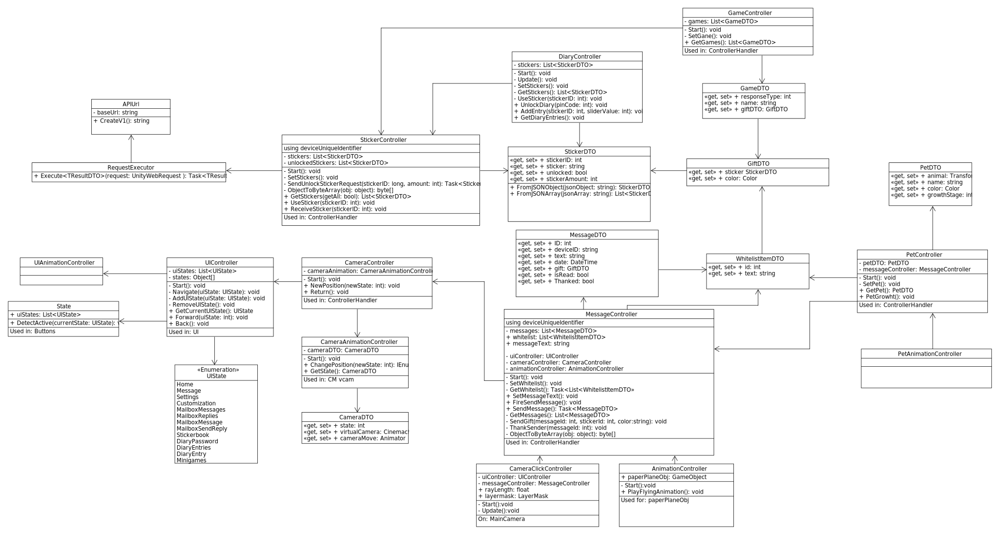

# kind-regards-unity
Unity development for the prototype of "Kind Regards"

## Table of contents

<!-- TOC -->

- [kind-regards-unity](#kind-regards-unity)
    - [Table of contents](#table-of-contents)
    - [Documentation](#documentation)
    - [Before you start](#before-you-start)
    - [Unity version](#unity-version)
    - [Design philosophy](#design-philosophy)
    - [Base UML Diagram](#base-UML-diagram)
    - [Main components](#main-components)

<!-- /TOC -->

## Documentation
This project includes documentation that explains the structure and philosophy of the Unity segment. The diagrams for UML were made in Umlet.

## Before you start
The project was started with the idea of extendibility. For this reason, optimisation was secondary and it was more important to ensure a good base for the project.

## Unity version
Unity project is running on 2021.3.3f1

## Design philosophy
The design is based on the SOLID principle. With that one of the main things is we what to limit how scripts communicate. Due to the way that unity works if there are a lot of small scripts talking to other small scripts it becomes really hard to know where everything is and how is connected.

## Base UML Diagram

## Main components
The main components and the idea behind them as described by the UML.

**Components** 
Components is what we call the different segments. For example, we have Pet, Diary, Message, Camera, UI, etc.

**Controllers** 
We start with the controllers. They are the main part for each of the components. Since it is the main part for the component it handles the processes of the component and communication between different scripts in the component. When it comes to communication between components it is done true the controller. This way it is a lot easier to know how everything is connected.

**Animation Controller** 
The different animation controllers control the animation for each respective animator. Clearly showing knowing what the process is.

**DTO** 
The DTO as the name says is how we store data when the game is running it allows us to keep all the different parameters for each object in one place so it is not spared around and if a different component needs the information it is a lot easier to provide it.